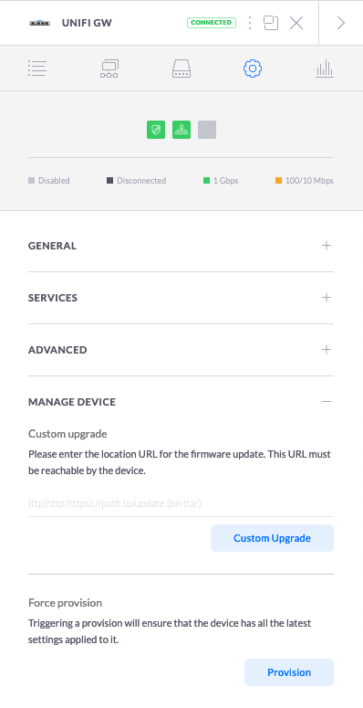
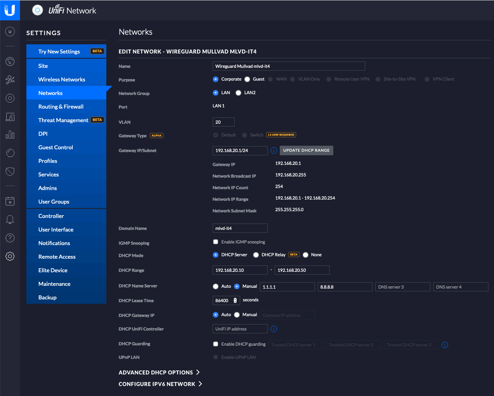
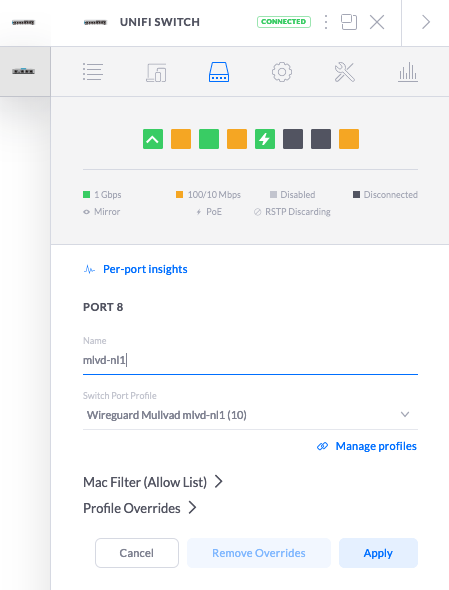

# Multiple Wireguard Tunnels with Unifi Security Gateway

This is a quick guide on how to enable wireguard support in the Unifi Security Gateway (USG) and establish multiple indipendent vpn tunnels on separate VLANs with policy based routing.

## Network Setup
My network setup is as follows:

* **USG 3P** (FW Version: 4.4.52.5363511, Kernel Version: 3.10.107-UBNT)
* **Switch US-8-60W**
* **Unifi Contoller** (Version 6.0.45, running as [docker container](https://hub.docker.com/r/jacobalberty/unifi/))
* **VPN Provider** - [Mullvad](mullvad.net/)

## Install Wireguard kernel module and tools

First you need to install the latest version of wireguard for your USG and generate your wireguard key(s).

Follow the instructions at https://github.com/WireGuard/wireguard-vyatta-ubnt

At this point you should be able to run wg command:

```
francesco@UnifiGW:~$ sudo wg --help
Usage: wg <cmd> [<args>]

Available subcommands:
  show: Shows the current configuration and device information
  showconf: Shows the current configuration of a given WireGuard interface, for use with setconf
  set: Change the current configuration, add peers, remove peers, or change peers
  setconf: Applies a configuration file to a WireGuard interface
  addconf: Appends a configuration file to a WireGuard interface
  syncconf: Synchronizes a configuration file to a WireGuard interface
  genkey: Generates a new private key and writes it to stdout
  genpsk: Generates a new preshared key and writes it to stdout
  pubkey: Reads a private key from stdin and writes a public key to stdout
You may pass --help to any of these subcommands to view usage.
```
You can generate your private keys using this command on your USG:

```bash
wg genkey | tee /config/auth/wg.key | wg pubkey >  wg.public
```


## Provisioning

In order to keep the configuration persistent across reboots, it has to be provisioned from the Unifi Controller via a `config.gateway.json` file usually located in the `sites/default` directory of your controller.

The `config.gateway.json` in this reposiroty creates two wireguard interfaces `wg0` and `wg1` and two virtual lans each associated to a separate virtual interface (`eth1.10` and `eth1.20`). Then, for each virtual interface, creates firewall and NAT rules to process all traffic coming in from these interfaces via a modified `policy based routing` table.

The policy based route will direct all traffic (`0.0.0.0/0`) from a particular VLAN through the assigned tunnel interface while still allowing the VLAN subnet to reach the rest of the local network (`192.168.1.0/24`). The `blackhole` route ensures that traffic from the corresponding VLAN will be dropped in case the tunnel is down for whatever reason.

You can adjust this `config.gateway.json` to your needs. Before deploying it to your USG, it is always a good idea to check for syntaxt correctness with a JS linting tool such as https://jsonlint.com/

### config.gateway.json
<details>
  <summary>config.gateway.json</summary>

```json
{     
    "firewall": {         
        "modify": {             
            "mlvd-nl1": {
                "rule": {
                    "10": {
                        "action": "modify",
                        "description": "Mullvad mlvd-nl1 Tunnel",
                        "modify": {
                            "table": "1"
                        },
                        "source": {
                            "address": "192.168.10.0/24"
                        }
                    }
                }
            },
            "mlvd-it4": {
                "rule": {
                    "20": {
                        "action": "modify",
                        "description": "Mullvad mlvd-it4 Tunnel",
                        "modify": {
                            "table": "2"
                        },
                        "source": {
                            "address": "192.168.20.0/24"
                        }
                    }
                }
            }
        },
        "source-validation": "disable"
    },
    "interfaces": {         
        "ethernet": {             
            "eth1": {               
                "vif": {
                    "10": {
                        "address": [
                            "192.168.10.1/24"
                        ],
                        "firewall": {
                            "in": {
                                "ipv6-name": "LANv6_IN",
                                "modify": "mlvd-nl1",
                                "name": "LAN_IN"
                            },
                            "local": {
                                "ipv6-name": "LANv6_LOCAL",
                                "name": "LAN_LOCAL"
                            },
                            "out": {
                                "ipv6-name": "LANv6_OUT",
                                "name": "LAN_OUT"
                            }
                        }
                    },
                    "20": {
                        "address": [
                            "192.168.20.1/24"
                        ],
                        "firewall": {
                            "in": {
                                "ipv6-name": "LANv6_IN",
                                "modify": "mlvd-it4",
                                "name": "LAN_IN"
                            },
                            "local": {
                                "ipv6-name": "LANv6_LOCAL",
                                "name": "LAN_LOCAL"
                            },
                            "out": {
                                "ipv6-name": "LANv6_OUT",
                                "name": "LAN_OUT"
                            }
                        }
                    }
                }
            }         
        },         
        "wireguard": {             
            "wg0": {
                "description": "mlvd-nl1",
                "address": "10.70.255.40/32",
                "listen-port": "51820",
                "private-key": "<PEER PUBLIC KEY>",
                "route-allowed-ips": "false",
                "peer": {
                    "<PEER PUBLIC KEY>": {
                        "allowed-ips": "0.0.0.0/0",
                        "endpoint": "193.32.249.66:51820",
                        "persistent-keepalive": "60"
                    }
                }
            },
            "wg1": {
                "description": "mlvd-it4",
                "address": "10.71.10.240/32",
                "listen-port": "51821",
                "private-key": "<PEER PUBLIC KEY>",
                "route-allowed-ips": "false",
                "peer": {
                    "<PEER PUBLIC KEY>": {
                        "allowed-ips": "0.0.0.0/0",
                        "endpoint": "91.193.5.2:51820",
                        "persistent-keepalive": "60"
                    }
                }
            }
        }
    },
    "service": {         
        "nat": {             
            "rule": {                 
                "5000": {
                    "description": "Mullvad NL-1 Clients",
                    "log": "disable",
                    "outbound-interface": "wg0",
                    "source": {
                            "address": "192.168.10.0/24"
                    },
                    "type": "masquerade"
                },
                "5001": {
                    "description": "Mullvad IT-4 Clients",
                    "log": "disable",
                    "outbound-interface": "wg1",
                    "source": {
                            "address": "192.168.20.0/24"
                    },
                    "type": "masquerade"
                }         
            }         
        }     
    },     
    "protocols": {       
        "static": {         
            "table": {           
                "1": {
                    "interface-route": {               
                        "0.0.0.0/0": {                 
                            "next-hop-interface":  {
                                "wg0": "''"
                            }                            
                        }             
                    },
                    "route": {
                        "0.0.0.0/0": {
                            "blackhole": {
                                "distance": "1"
                            }
                        },
                        "192.168.1.0/24": {
                            "next-hop": {
                                "192.168.1.1": "''"
                            }
                        }
                    }
                },
                "2": {
                    "interface-route": {               
                        "0.0.0.0/0": {                 
                            "next-hop-interface":  {
                                "wg1": "''"
                            }                            
                        }             
                    },
                    "route": {
                        "0.0.0.0/0": {
                            "blackhole": {
                                "distance": "1"
                            }
                        },
                        "192.168.1.0/24": {
                            "next-hop": {
                                "192.168.1.1": "''"
                            }
                        }
                    }
                }
            }       
        }     
    }
}
```
</details>

<br>

In order to deploy the configuration you have to go to the `devices` section of your Unifi controller UI, click on your Unifi GW and, under the settings tab, do a `force provision`.



## Create a network

Once you have provisioned your USG, create the VLAN network(s) in your controller's settings. The image below shows how to create the network for the VLAN 20 associated with the `eth1.20` interface.




All devices in this network will be routed through the tunnel `wg0`

## Assign the newly created network to a port on your switch

If you have a configurable Unifi switch managed by your controller, you can also associate the newly created network to a specific port on your switch so that all the devices connected to that port will receive a dhcp address in that network vlan and will be routed through the associated tunnel.

